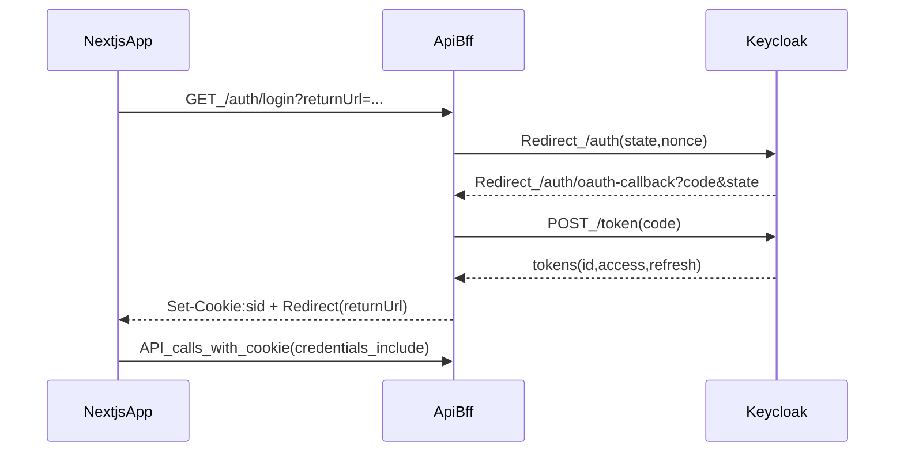
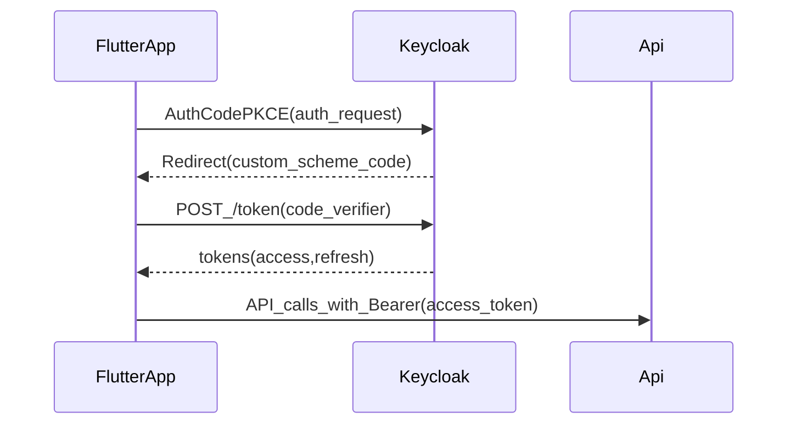
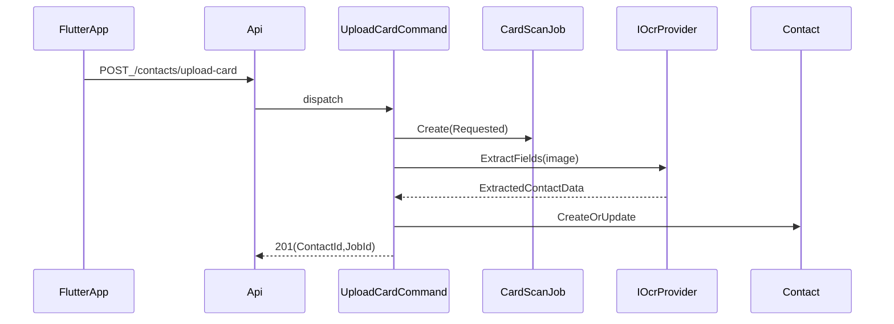
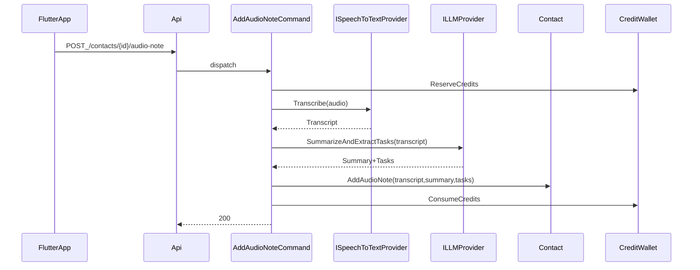

# Modelo de Domínio + Testes Integrados (AssistenteExecutivo)

## Objetivo
- Derivar do PRD do **Assistente Executivo de IA** um **modelo de domínio detalhado (DDD)** e uma **estratégia de testes integrada**, priorizando **testabilidade no domínio**.
- Target stack: **C# / .NET 10** (VS2026), **web Next.js**, **app Flutter**.

## Fonte de Requisitos
- Documento: `documents/Assistente_Executivo_IA_PRD_Completo.htm` (derivado do PRD original `.docx`).

## Assunções (para destravar)
- Nome do produto/projeto/backend: **AssistenteExecutivo**.
- Backend: **modular monolith** com Clean Architecture (evolui para microserviços se necessário).
- Autenticação via **Keycloak (OAuth2/OIDC)** e backend como **Resource Server** validando **JWT Bearer**.
- Persistência principal em **PostgreSQL** (CRM/Capture/Automation/Billing) + armazenamento de mídia (S3/Azure Blob/local no dev).

## Autenticação (Keycloak) — decisão fechada (Web BFF + Mobile Bearer)

### Domínios (mesmo domínio raiz)
- Web (Next.js): `https://app.seudominio.com`
- API/BFF: `https://api.seudominio.com`
- Keycloak: `https://sso.seudominio.com`

### Decisão de arquitetura
- **Web (Next.js)**: modelo **BFF**. A **API faz o token exchange** e o **browser não recebe tokens**. A web autentica via **cookie HttpOnly** (sessão do backend).
- **Mobile (Flutter)**: **Authorization Code + PKCE (S256)** direto no Keycloak. O app troca `code -> tokens` no IdP e chama a API com `Authorization: Bearer <access_token>`.

### Keycloak — configuração de Clients
#### Client Web (BFF)
- **Tipo**: Confidential
- **Flows**:
  - Standard Flow (Authorization Code): **ON**
  - Direct Access Grants (password grant): **OFF**
- **Redirect URI**:
  - `https://api.seudominio.com/auth/oauth-callback`
- **Valid Post Logout Redirect URIs**:
  - `https://app.seudominio.com/*`
- **Client authentication**: secret (mTLS/JWT client auth é opcional futuro)

#### Client Mobile (Flutter)
- **Tipo**: Public
- **Flows**:
  - Standard Flow: **ON**
  - **PKCE**: obrigatório (**S256**)
- **Redirect URI**:
  - `com.seuapp://auth/callback` (ou o esquema definitivo do app)
- **Refresh token**: habilitar (preferir rotação, se disponível)

## Escopo funcional coberto (a partir do PRD)
### MVP (Módulo 1)
- **Autenticação**:
  - **Web (BFF)**:
    - `GET /auth/login?returnUrl=<url-do-app>`
    - `GET /auth/oauth-callback?code=...&state=...`
    - `GET /auth/session`
    - `POST /auth/logout`
    - `GET /auth/csrf` (para POST/PUT/DELETE via cookie)
  - **Mobile**:
    - login direto no Keycloak (PKCE) e chamadas na API com Bearer
- **CRM + Captura**:
  - Digitalização de cartão (OCR): `POST /contacts/upload-card`
  - Nota por áudio com transcrição + resumo + extração de tarefas: `POST /contacts/{id}/audio-note`
  - CRUD de contatos:
    - `GET /contacts`
    - `GET /contacts/{id}`
    - `PUT /contacts/{id}`
    - `DELETE /contacts/{id}`

### Pós-MVP (Módulos 2–3)
- **Enriquecimento de perfil**: mapear redes (LinkedIn/X), consolidar histórico.
- **Árvore de relacionamentos**: conexões em comum, grafo.
- **KYC/Due Diligence**: varredura em fontes públicas e relatório.
- **Automação e ação estratégica**:
  - Estratégias de aproximação.
  - Lembretes inteligentes (nutrição).
  - Assistente de redação (emails/ofícios/invites) + aplicação de **papel timbrado** via template.
  - Sugestão de conteúdo para redes sociais.

### Negócio
- **Assinatura (tiers)** + **créditos** para ações “custosas” de IA (transcrição longa, enriquecimento, KYC).

## Bounded Contexts (DDD)
- **Identity**: identidade externa (Keycloak) + perfil local + autorização (roles/claims) + auditoria.
- **CRM**: contatos, empresas, interações, tags, relacionamentos.
- **Capture**: ingestão de mídia (imagem/áudio), jobs, resultados, anexos.
- **Intelligence**: enriquecimento, grafo social, KYC.
- **Automation**: lembretes, drafts (email/ofício/invite), templates.
- **Billing**: planos, assinaturas, carteira de créditos, consumo.

## Modelo de Domínio (detalhado)

### Linguagem Ubíqua (termos do domínio)
- **Usuário**: pessoa que usa o sistema (executivo/gestor/etc.).
- **Contato**: pessoa/lead/cliente/parceiro cadastrado no CRM interno.
- **Empresa**: organização associada a um contato.
- **Interação**: registro estruturado de contato com o contato (nota, reunião, e-mail, ligação, tarefa, documento enviado).
- **Captura**: ato de transformar mídia (imagem/áudio) em dados estruturados no CRM.
- **Mídia**: arquivo (imagem do cartão, áudio) armazenado e referenciado.
- **Job**: processamento assíncrono (OCR, transcrição, enriquecimento, KYC).
- **Enriquecimento**: coleta/consolidação de informações públicas (ex: LinkedIn) para complementar o contato.
- **Grafo de relacionamentos**: conexões em comum e caminhos relevantes.
- **KYC/Due diligence**: verificação automatizada em fontes públicas para identificar riscos e “red flags”.
- **Lembrete**: recomendação/alerta para reativar ou nutrir relacionamento (com motivo e timing).
- **Draft**: rascunho de e-mail/ofício/invite gerado com base em contexto e template.
- **Template**: modelo reutilizável (texto + placeholders) e/ou papel timbrado.
- **Plano (tier)**: assinatura com limites (contatos/armazenamento/recursos premium).
- **Créditos**: unidade interna consumida por operações intensivas (transcrição longa, perfil complexo, KYC).

### Princípios de modelagem (para testabilidade)
- **Domínio determinístico**: sem dependência direta de tempo/IO; usar `IClock`, `IIdGenerator` e “ports” para provedores externos.
- **Eventos de domínio** como saída principal do agregado (para disparar jobs, notificações e integrações).
- **Regras explícitas**: invariantes em agregados, políticas em `*Policy`/`*Specification`, regras multi-agregado em `DomainServices`.

### Value Objects (VOs)
- **Identity**
  - `UserId`, `EmailAddress`, `DisplayName`.
  - `KeycloakSubject` (`sub`), `KeycloakRealm`, `OidcProvider` (se futuramente suportar mais de um).
  - `LoginContext` (ip, userAgent, authMethod, correlationId).
- **CRM**
  - `ContactId`, `PersonName`, `PhoneNumber`, `CompanyId`, `CompanyName`.
  - `Tag` (VO), `InteractionId`, `InteractionType` (enum), `InteractionSummary`.
- **Capture**
  - `MediaId`, `MediaRef` (storageKey + hash + mimeType + size), `AudioDuration`.
  - `JobId`, `JobStatus`, `JobError` (code + message).
  - `OcrExtract` (campos + confiança), `Transcript`, `TranscriptSegment`, `ExtractedTask`.
- **Intelligence**
  - `SocialProfileId`, `ExternalProfileRef`, `ProfileSnapshot` (VO imutável).
  - `GraphSnapshotId`, `ConnectionEdge`, `ConnectionPath`.
  - `ReportId`, `RiskScore`, `Finding` (tipo/fonte/gravidade).
- **Automation**
  - `ReminderId`, `ReminderReason`, `ReminderSchedule` (data/recorrência), `NotificationChannel`.
  - `DraftId`, `DocumentType`, `TemplateId`, `LetterheadId`.
- **Billing**
  - `PlanId`, `PlanLimits` (maxContacts, maxStorageBytes, featureFlags).
  - `SubscriptionId`, `BillingInterval`, `CreditAmount`, `CreditTransactionId`, `IdempotencyKey`.

### Bounded Context: Identity
#### Integração (Keycloak OAuth2/OIDC) — base no projeto `samples/clinica`
- **Backend (.NET)**: replicar o padrão de validação JWT do Keycloak do projeto de referência:
  - `samples/clinica/src/Clinica.API/Extensions/AuthenticationExtensions.cs` (`AddKeycloakAuthentication(...)` + `AddJwtBearer`)
  - `samples/clinica/src/Clinica.API/Program.cs` (chama `AddKeycloakAuthentication(builder.Configuration)`)
- **Operações OAuth/Admin (quando necessário)**: basear em
  - `samples/clinica/src/Clinica.Infrastructure/Services/KeycloakService.cs`
  - `samples/clinica/src/Clinica.Infrastructure/DependencyInjection.cs` (registrando `IKeycloakService` com `HttpClient`)
  - `samples/clinica/src/Clinica.API/appsettings.json` seção `Keycloak`
- **Frontend**:
  - Web (Next.js): Authorization Code Flow (idealmente **PKCE**). Exemplo de callback + troca de código:
    - `samples/clinica/src/app/auth/callback/page.tsx` + endpoint backend `api/auth/oauth-callback`
  - Mobile (Flutter): Authorization Code Flow com PKCE (deep link / app link).

#### Web (BFF) — sessão, cookies, refresh e CSRF
- **Cookie recomendado**:
  - Nome: `sid` (ou `__Host-sid` se cumprir as regras)
  - Flags: `HttpOnly`, `Secure`, `SameSite=Lax`, `Path=/`
  - `Domain=.seudominio.com` apenas se precisar compartilhar entre `app.` e `api.` (caso contrário, prefira cookie host-only)
  - TTL: alinhado à sessão (ex.: 8h) + renovação
- **Store de sessão (server-side)**: recomendado **Redis**
  - Por sessão guardar: `access_token`, `refresh_token`, `expires_at`, `user_claims/roles`, metadados.
- **Renovação automática**:
  - A cada request autenticada: se `access_token` estiver perto de expirar (ex.: < 60s), o BFF faz refresh via `refresh_token` e atualiza a sessão.
- **CSRF** (por usar cookie):
  - manter `SameSite=Lax`
  - endpoints mutáveis exigem header `X-CSRF: <token>`
  - `GET /auth/csrf` emite token amarrado à sessão; backend valida contra sessão.

#### Mobile (Flutter) — PKCE e storage seguro
- Login com browser externo/in-app browser seguro + PKCE (S256).
- Refresh token em Keychain/Keystore.
- Chamada à API com `Authorization: Bearer <access_token>`.

#### Agregados
- **UserProfile** (perfil local vinculado ao Keycloak)
  - **Estado**: `Active | Suspended | Deleted` (soft delete).
  - **Campos**: `UserId`, `KeycloakSubject`, `Email`, `DisplayName`, `CreatedAt`, `LastLoginAt?`.
  - **Comportamentos**:
    - `ProvisionFromKeycloak(subject, email, displayName)` (cria/atualiza no primeiro login)
    - `UpdateProfile(patch)`
    - `RecordLogin(loginContext)`
  - **Invariantes**:
    - `KeycloakSubject` obrigatório e **imutável** após vínculo.
    - email válido.
    - não existir dois perfis locais com o mesmo `KeycloakSubject`.
- **LoginAuditEntry** (auditoria)
  - **Campos**: `UserId`, `OccurredAt`, `IpAddress`, `UserAgent`, `AuthMethod(password|oauth)`, `CorrelationId?`.
  - **Regras**:
    - falhas de auditoria **não bloqueiam** login (padrão do `samples/clinica`).

#### Eventos de domínio (Identity)
- `UserProvisionedFromKeycloak(UserId, KeycloakSubject)`
- `UserLoggedIn(UserId, AuthMethod)`
- `UserSuspended(UserId, Reason)`

### Bounded Context: CRM
#### Agregados
- **Contact**
  - **Campos**: `ContactId`, `OwnerUserId`, `Name`, `Emails[]`, `Phones[]`, `CompanyId?`, `Tags[]`, `CreatedAt`, `UpdatedAt`.
  - **Subentidades**:
    - `Interaction` (nota/reunião/documento/tarefa vinculada)
    - `AttachmentRef` (para mídia/documentos)
  - **Comportamentos**:
    - `CreateFromCardExtract(extract)`
    - `UpdateDetails(patch)`
    - `AddTextNote(text, createdAt)`
    - `AddAudioNote(mediaRef, transcript, summary, tasks[])`
    - `AddInteraction(interaction)`
    - `Delete()` (soft)
  - **Invariantes**:
    - ao menos 1 identificador de contato (email ou telefone) **quando criado via OCR** (se OCR não extrair, exigir revisão manual).
    - emails/telefones não podem duplicar dentro do contato.
    - `OwnerUserId` sempre definido.
- **Company**
  - **Campos**: `CompanyId`, `Name`, `Domains[]`, `Notes?`
  - **Regras**:
    - pode ser criada automaticamente a partir de OCR/enriquecimento, mas deve suportar merge.

#### Domain Services (CRM)
- **ContactDeduplicationService**
  - resolve “criar vs mesclar” com base em heurística (email/telefone domínio da empresa + similaridade).
  - produz decisão determinística (e testável) e emite `ContactMerged` quando aplicável.

#### Eventos de domínio (CRM)
- `ContactCreated(ContactId, OwnerUserId, Source)`
- `ContactUpdated(ContactId)`
- `ContactDeleted(ContactId)`
- `ContactMerged(SourceContactId, TargetContactId)`
- `InteractionAdded(ContactId, InteractionId, InteractionType)`

### Bounded Context: Capture
#### Agregados
- **MediaAsset**
  - **Campos**: `MediaId`, `OwnerUserId`, `MediaRef`, `CreatedAt`, `Kind(Image|Audio)`, `Metadata`.
  - **Invariantes**:
    - hash obrigatório (para dedup e integridade).
    - tamanho máximo governado por `PlanLimits`.
- **CaptureJob**
  - **Tipos**: `CardScan`, `AudioNoteTranscription`.
  - **Campos**: `JobId`, `OwnerUserId`, `ContactId?`, `MediaId`, `Status`, `RequestedAt`, `CompletedAt?`, `Error?`.
  - **Resultados**:
    - `CardScanResult`: `OcrExtract`, `SuggestedContactPatch`, `ConfidenceScores`
    - `AudioResult`: `Transcript`, `Summary`, `ExtractedTasks[]`
  - **Comportamentos**:
    - `RequestCardScan(mediaId)`
    - `RequestAudioProcessing(contactId, mediaId)`
    - `MarkProcessing()`, `Complete(result)`, `Fail(error)`
  - **Invariantes**:
    - transições válidas de status.
    - job concluído não pode ser reprocessado (novo job para retry).

#### Eventos de domínio (Capture)
- `MediaUploaded(MediaId, Kind)`
- `CaptureJobRequested(JobId, Type)`
- `CaptureJobCompleted(JobId, Type)`
- `CaptureJobFailed(JobId, ErrorCode)`

### Bounded Context: Intelligence
#### Agregados
- **ProfileEnrichmentJob**
  - **Inputs**: `ContactId`, email/nome (derivados).
  - **Outputs**: `ProfileSnapshotId`, `ExternalProfileRefs[]`, `EnrichmentSummary`.
  - **Regras**:
    - pode consumir créditos quando “perfil complexo” (configurável).
    - deve registrar fontes e timestamps (auditoria mínima).
- **RelationshipGraphSnapshot**
  - **Campos**: `SnapshotId`, `OwnerUserId`, `ContactId`, `Edges[]`, `ComputedAt`, `SourceRefs`.
  - **Regras**:
    - snapshot é imutável (nova versão em cada recomputação).
- **DueDiligenceReport**
  - **Campos**: `ReportId`, `ContactId?`, `CompanyId?`, `Findings[]`, `RiskScore`, `GeneratedAt`, `ValidUntil?`.
  - **Regras (PRD)**:
    - deve buscar processos judiciais, menções negativas na mídia e outros “red flags” em fontes públicas.
    - relatório deve referenciar fontes (URLs/ids de fonte).

#### Eventos de domínio (Intelligence)
- `EnrichmentRequested(ContactId, JobId)`
- `EnrichmentCompleted(ContactId, SnapshotId)`
- `DueDiligenceRequested(TargetType, TargetId, ReportId)`
- `DueDiligenceCompleted(ReportId, RiskScore)`

### Bounded Context: Automation
#### Agregados
- **Reminder**
  - **Campos**: `ReminderId`, `OwnerUserId`, `ContactId`, `Reason`, `SuggestedMessage?`, `ScheduledFor`, `Status(Pending|Sent|Dismissed|Snoozed)`.
  - **Regras (PRD)**:
    - lembrete deve ter **motivo** (ex: aniversário da empresa, notícia relevante).
    - pode depender de integrações (notícias, calendário) — via ports.
- **DraftDocument**
  - **Tipos**: `Email`, `Oficio`, `Invite`.
  - **Campos**: `DraftId`, `OwnerUserId`, `ContactId?`, `CompanyId?`, `DocumentType`, `TemplateId?`, `LetterheadId?`, `Content`, `Status(Draft|Approved|Sent)`.
  - **Regras (PRD)**:
    - geração baseada em contexto do relacionamento + templates.
    - suportar aplicação de papel timbrado (template estilo Canva) como etapa de renderização.
- **Template**
  - **Campos**: `TemplateId`, `OwnerUserId`, `Name`, `PlaceholdersSchema`, `Body`, `Active`.
  - **Variações**:
    - `LetterheadTemplate` (branding/layout) separado do `TextTemplate` (conteúdo).

#### Eventos de domínio (Automation)
- `ReminderScheduled(ReminderId, ContactId, ScheduledFor)`
- `ReminderStatusChanged(ReminderId, NewStatus)`
- `DraftCreated(DraftId, DocumentType)`
- `DraftApproved(DraftId)`

### Bounded Context: Billing
#### Agregados
- **Plan**
  - **Campos**: `PlanId`, `Name`, `Limits(contacts/storage/features)`, `IsActive`.
  - **Regras**:
    - limites dirigem validações em CRM/Capture (max contatos, max storage).
- **Subscription**
  - **Campos**: `SubscriptionId`, `OwnerUserId`, `PlanId`, `Interval(Monthly|Yearly)`, `Status(Active|PastDue|Canceled)`, `StartedAt`, `RenewsAt?`.
  - **Regras (PRD)**:
    - assinatura define acesso a funcionalidades premium + cota de créditos.
- **CreditWallet**
  - **Modelo**: ledger (imutável) + saldo derivado.
  - **Transações**: `Grant`, `Purchase`, `Reserve`, `Consume`, `Refund`, `Expire`.
  - **Invariantes**:
    - saldo nunca pode ficar negativo.
    - idempotência obrigatória para operações cobradas (`IdempotencyKey`).
  - **Regras (PRD)**:
    - transcrições longas, enriquecimento complexo e KYC consomem créditos.
    - usuário pode comprar pacotes adicionais.

#### Eventos de domínio (Billing)
- `SubscriptionActivated(SubscriptionId, PlanId)`
- `SubscriptionCanceled(SubscriptionId)`
- `CreditsGranted(OwnerUserId, Amount)`
- `CreditsReserved(OwnerUserId, Amount, Purpose)`
- `CreditsConsumed(OwnerUserId, Amount, Purpose)`
- `CreditsRefunded(OwnerUserId, Amount, Purpose)`

### Regras transversais (Policies/Specifications)
- **PlanLimitPolicy**
  - `CanCreateContact(owner)` / `CanStoreMedia(owner, size)` / `HasFeature(owner, featureFlag)`.
- **CreditCostPolicy**
  - define custo por operação e parâmetros (ex: minutos de áudio, “complexidade” de perfil, tipo de KYC).
- **IdempotencyPolicy**
  - garante que endpoints “custosos” não cobrem duas vezes (mesma requisição).

### Mapeamento MVP: Endpoints -> Casos de Uso -> Domínio
- **Web (BFF)**
  - `GET /auth/login?returnUrl=...`
    - **Use case**: `StartOAuthLogin` (gera `state/nonce` e redireciona para o Keycloak)
  - `GET /auth/oauth-callback?code=...&state=...`
    - **Use case**: `OAuthCallback` (valida `state/nonce`, troca `code -> tokens`, cria sessão e cookie)
    - **Agregados**: `UserProfile`, `LoginAuditEntry`
  - `GET /auth/session`
    - **Use case**: `GetSession` (retorna dados não sensíveis)
  - `GET /auth/csrf`
    - **Use case**: `GetCsrfToken`
  - `POST /auth/logout`
    - **Use case**: `Logout` (invalida sessão e expira cookies; opcional SLO)
- **Mobile**
  - Login PKCE direto no Keycloak; a API protege recursos com Bearer.
  - **Use case**: `ProvisionUserOnFirstSeen` (ao ver um `sub` novo, criar/atualizar `UserProfile`)

### Endpoints (Web/BFF) — contratos recomendados
1) **Iniciar login**
- `GET /auth/login?returnUrl=<url-do-app>`
- A API:
  - gera `state` e `nonce`
  - (opcional) gera PKCE (S256) e guarda `code_verifier` server-side associado ao `state`
  - redireciona pro Keycloak (`/protocol/openid-connect/auth`)

2) **Callback**
- `GET /auth/oauth-callback?code=...&state=...`
- A API:
  - valida `state` (anti-CSRF do OAuth)
  - troca `code -> tokens` no Keycloak (token endpoint) usando client **confidential**
  - valida `id_token` (nonce, assinatura, issuer, audience)
  - cria sessão backend e seta cookie HttpOnly
  - redireciona para `returnUrl`

3) **Sessão atual**
- `GET /auth/session`
- Retorna apenas `userId`, `name`, `roles`, `expiresAt` — **não retorna tokens**.

4) **Logout**
- `POST /auth/logout`
- A API:
  - invalida sessão server-side
  - expira cookies
  - opcional: logout do Keycloak (single logout)
- `POST /contacts/upload-card`
  - **Use case**: `UploadCardAndRequestOcr`
  - **Agregados**: `MediaAsset`, `CaptureJob`
  - **Eventos**: `MediaUploaded`, `CaptureJobRequested`
- `POST /contacts/{id}/audio-note`
  - **Use case**: `AddAudioNoteAndProcess`
  - **Agregados**: `MediaAsset`, `CaptureJob`, `Contact`, `CreditWallet` (se aplicável)
  - **Eventos**: `CaptureJobRequested`, `InteractionAdded`, `CreditsReserved/Consumed`
- `GET /contacts`, `GET /contacts/{id}`
  - **Use cases**: `ListContacts`, `GetContactById`
  - **Consulta** (read model)
- `PUT /contacts/{id}`
  - **Use case**: `UpdateContact`
  - **Agregado**: `Contact`
  - **Eventos**: `ContactUpdated`
- `DELETE /contacts/{id}`
  - **Use case**: `DeleteContact`
  - **Agregado**: `Contact`
  - **Eventos**: `ContactDeleted`

## Arquitetura proposta (C# / .NET 10)
### Estrutura de solução (monorepo)
- `backend/AssistenteExecutivo.sln`
- `backend/src/AssistenteExecutivo.Domain`
- `backend/src/AssistenteExecutivo.Application`
- `backend/src/AssistenteExecutivo.Infrastructure`
- `backend/src/AssistenteExecutivo.Api`
- `backend/tests/AssistenteExecutivo.Domain.Tests`
- `backend/tests/AssistenteExecutivo.Application.IntegrationTests`
- `backend/tests/AssistenteExecutivo.Api.ContractTests`
- `web/` (Next.js)
- `app/` (Flutter)

### Decisões de testabilidade no domínio (regras)
- **Domínio sem IO**: sem EF, sem HttpClient, sem `DateTime.UtcNow` direto.
- Dependências externas apenas via **ports**:
  - `IOcrProvider`, `ISpeechToTextProvider`, `ILLMProvider`, `IKycProvider`, `INewsProvider`, `IFileStore`, `IClock`.
- **Determinismo**: injetar clock, ids via `IIdGenerator` onde necessário.
- Regras de negócio concentradas em:
  - métodos do agregado (invariantes)
  - domain services (regras que cruzam agregados)
  - policies/specifications (ex: elegibilidade a lembrete)

## Estratégia de Testes (integrada)
### 1) Testes do Domínio (rápidos)
- xUnit + FluentAssertions.
- Cobrir:
  - invariantes de agregados (ex: contato não pode ter email inválido)
  - transições de estado de `CaptureJob`
  - ledger de créditos (idempotência, reserva/consumo/refund)
  - emissão de eventos de domínio

### 2) Testes de Integração (Application)
- Handler completo (CQRS): comando -> persistência -> outbox/eventos.
- Banco real com **Testcontainers PostgreSQL** (se Docker disponível).
- Stubs para providers externos (OCR/STT/LLM/KYC) com contratos estáveis.
- Auth (Keycloak):
  - **Opção A**: Testcontainers **Keycloak** (realm + client de teste) para validar JWT real e fluxos de callback.
  - **Opção B**: tokens JWT assinados por chave de teste + configuração de `Authority`/JWKS fake (para testes rápidos).

## Next.js (Web) — integração prática (BFF)
- Páginas protegidas devem consultar `GET https://api.seudominio.com/auth/session` (SSR ou client).
- Se 401: redirecionar para `/login` no app; a rota `/login` apenas redireciona para `https://api.seudominio.com/auth/login?returnUrl=...`.
- Requisições para API:
  - `credentials: "include"` (fetch) para enviar cookie
  - **sem Bearer token no browser**

## Flutter (Mobile) — integração prática
- Fluxo: browser externo/in-app browser seguro + PKCE (S256).
- Storage: refresh token em Keychain/Keystore.
- Chamadas à API: `Authorization: Bearer <access_token>`.
- Renovação: usar refresh token para obter novo access token quando expirar.

## Autorização e roles (coerência web + mobile)
- Definir roles no Keycloak (realm roles ou client roles).
- **Web (sessão)**: no login, o BFF extrai claims/roles do `id_token` (ou via `userinfo`) e armazena na sessão.
- **Mobile (bearer)**: a API lê roles direto do JWT.

## Segurança — mínimo aceitável (checklist)
- CSP forte no app (reduzir XSS).
- Cookies: `HttpOnly + Secure + SameSite=Lax`.
- CSRF token em endpoints mutáveis (header `X-CSRF`).
- Rotação de refresh token (se disponível).
- Validação estrita do JWT (`iss`, `aud`, `jwks`, `exp`).
- Access token curto (ex.: 5–10 min).
- Logs/auditoria: `login`, `refresh`, `logout`, e “token reuse” (se suportado).
- Rate limit em `/auth/login` e `/auth/oauth-callback`.

## Sequências (documentação)

### Web (BFF)

### Mobile (PKCE)

### 3) Testes de Contrato (API)
- `Microsoft.AspNetCore.Mvc.Testing` (WebApplicationFactory).
- Validar endpoints do PRD e schemas.
- Geração de **OpenAPI** para consumo por Next.js/Flutter.

## Diagramas (para guiar implementação)
### Fluxo: captura de cartão (OCR)

### Fluxo: nota por áudio

## Entregáveis
- Documento de **modelo de domínio** (agregados, VOs, eventos, invariantes, regras) cobrindo todos os módulos do PRD.
- Esqueleto de solução .NET 10 (Clean Architecture) pronto para evoluir.
- Suite de testes: domínio + integração + contrato.
- OpenAPI + convenções para clientes Next.js/Flutter.

## Próximos passos (execução)
- Confirmar estrutura do monorepo e naming final (`AssistenteExecutivo.*`).
- Implementar esqueleto + domínio MVP (Auth + Contacts + Capture jobs + CreditWallet).
- Adicionar testes do domínio e integração para os fluxos do MVP.
- Evoluir para módulos 2–3 com providers pluggáveis e testes focados em regras.

## TODOs (implementação)
- **parse-prd**: Extrair e normalizar requisitos do PRD (MVP + módulos 2–3 + billing) e transformar em backlog técnico e regras de domínio.
- **solution-skeleton**: Criar solução .NET 10 (Domain/Application/Infrastructure/Api) + padrões de testabilidade (`IClock`, ports) + configuração de testes.
- **domain-mvp**: Implementar domínio MVP (Identity mínimo, `Contact`, `CaptureJob`, pipeline de áudio, `CreditWallet`) com eventos de domínio.
- **tests-domain**: Criar suíte de testes do domínio para invariantes, transições de jobs e ledger de créditos.
- **tests-integration**: Criar testes de integração (handlers + persistência) e testes de contrato da API (endpoints do PRD).
- **openapi-clients**: Gerar/validar OpenAPI e definir convenções de consumo para Next.js e Flutter (DTOs/serialização/erros).

