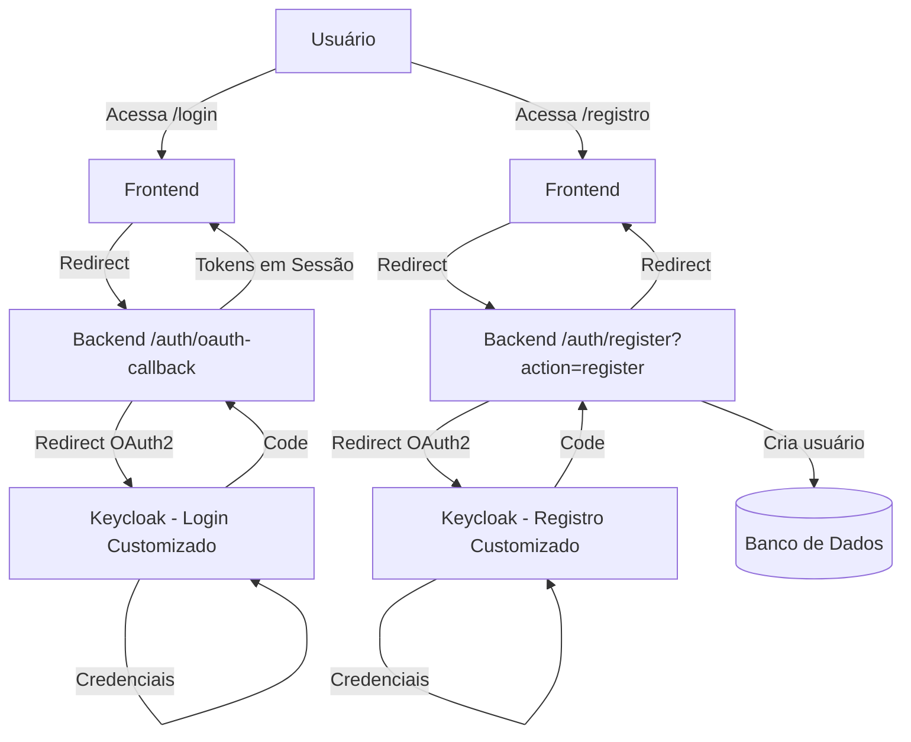

# Implementação: Customização de Themes Keycloak (Opção 3)

## Objetivo

Customizar as páginas de login e registro do Keycloak para parecerem parte do sistema AssistenteExecutivo, eliminando a necessidade de manter telas próprias no frontend e melhorando a segurança (senhas nunca passam pelo frontend).

## Configuração de Hosts Oficiais

### Hosts Externos (Tunnels para Testes)

Os seguintes hosts serão utilizados para acesso externo durante desenvolvimento e testes:

- **Keycloak (Auth)**: `https://auth.callback-local-cchagas.xyz` → `http://localhost:8080`
- **Frontend (Web)**: `https://assistente.callback-local-cchagas.xyz` → `http://localhost:3000`
- **Backend API**: `https://assistente-api.callback-local-cchagas.xyz` → `http://localhost:5239`

### Configurações Atualizadas

**appsettings.Development.json**:
- `Keycloak:PublicBaseUrl`: `https://auth.callback-local-cchagas.xyz`
- `Frontend:PublicBaseUrl`: `https://assistente.callback-local-cchagas.xyz`
- `Api:PublicBaseUrl`: `https://assistente-api.callback-local-cchagas.xyz`

**Métodos Atualizados**:
- `BuildFrontendRedirectUrl()`: Usa `Frontend:PublicBaseUrl` quando disponível
- `BuildRedirectUris()`: Inclui `Api:PublicBaseUrl` nos redirect URIs
- `BuildWebOrigins()`: Inclui `Frontend:PublicBaseUrl` nas origens permitidas
- `BuildResetPasswordUrl()`: Usa `Frontend:PublicBaseUrl` quando disponível

**Provisionamento de Realm**:
- `UpdateRealmFrontendUrlAsync()`: Configura `frontendUrl` do realm com `Keycloak:PublicBaseUrl`

## Situação Atual

### Telas Existentes no Frontend

1. **`/login`** (`web/src/app/login/LoginClient.tsx`)
   - Apenas redireciona para Keycloak via `/auth/login`
   - Não coleta credenciais (já usa OAuth2)
   - **Status**: Pode ser simplificada ou removida

2. **`/registro`** (`web/src/app/registro/page.tsx`)
   - Formulário próprio que coleta: email, senha, confirmarSenha, primeiroNome, sobrenome
   - Envia senhas para `/auth/register` no backend
   - **Status**: Deve ser movida para Keycloak (segurança)

### Design System Atual

- **Cores primárias**: Indigo (`indigo-600`, `indigo-500`, `indigo-700`)
- **Gradientes**:
  - Light: `from-blue-50 to-indigo-100`
  - Dark: `from-gray-900 via-gray-800 to-gray-900`
- **Componentes**:
  - Cards: `rounded-2xl shadow-xl`
  - Botões: `bg-indigo-600 hover:bg-indigo-700`
  - Inputs: `border-gray-300 dark:border-gray-600 rounded-lg`
- **Tipografia**: Inter, Geist Sans
- **Dark mode**: Suportado via classe `.dark`

## Solução Proposta

### Arquitetura



### Mudanças Necessárias

#### 1. Frontend - Simplificar/Remover Telas

**`/login`**: Simplificar para apenas redirecionar
- Remover componente `LoginClient.tsx` complexo
- Criar página simples que redireciona imediatamente

**`/registro`**: Remover completamente
- Remover formulário que envia senhas
- Redirecionar para Keycloak com parâmetro `action=register`

#### 2. Backend - Adicionar Suporte a Registro via OAuth2

**`AuthController`**: Adicionar endpoint de registro via OAuth2
- Criar endpoint `/auth/register` que redireciona para Keycloak
- Modificar `/auth/oauth-callback` para detectar ação de registro
- Criar usuário no banco após autenticação bem-sucedida

#### 3. Keycloak - Criar Theme Customizado

**Estrutura do Theme**:
```
keycloak/themes/assistenteexecutivo/
├── login/
│   ├── theme.properties
│   ├── login.ftl
│   ├── login-reset-password.ftl
│   ├── register.ftl
│   ├── resources/
│   │   ├── css/
│   │   │   └── login.css
│   │   ├── img/
│   │   │   └── logo.png
│   │   └── js/
│   │       └── login.js
│   └── messages/
│       └── messages_pt_BR.properties
└── account/
    └── ...
```

**Customizações**:
- Logo da aplicação
- Cores (indigo-600, indigo-500)
- Gradientes (blue-50 to indigo-100)
- Tipografia (Inter, Geist Sans)
- Dark mode
- Estilos de botões e inputs

#### 4. Backend - Configurar Theme Automaticamente

**`KeycloakService`**: Adicionar método para configurar theme
- `ConfigureRealmThemeAsync(string realmId, string themeName)`
- Integrar no provisionamento automático de realms

## Plano de Implementação

### Fase 1: Preparação e Estrutura do Theme (2-3 horas)

#### 1.1 Criar Estrutura de Diretórios
- [ ] Criar diretório `keycloak/themes/assistenteexecutivo/`
- [ ] Criar subdiretórios: `login/`, `login/resources/css/`, `login/resources/img/`, `login/resources/js/`, `login/messages/`

#### 1.2 Configurar Theme Base
- [ ] Criar `theme.properties` com metadados do theme
- [ ] Configurar nome, descrição, versão

**Arquivo**: `keycloak/themes/assistenteexecutivo/login/theme.properties`
```properties
parent=keycloak
import=common/keycloak
```

### Fase 2: Customização Visual (4-6 horas)

#### 2.1 CSS Customizado
- [ ] Criar `login.css` com cores e estilos do AssistenteExecutivo
- [ ] Implementar suporte a dark mode
- [ ] Customizar botões, inputs, cards
- [ ] Adicionar gradientes e sombras

**Arquivo**: `keycloak/themes/assistenteexecutivo/login/resources/css/login.css`
```css
:root {
    --primary-color: #4F46E5; /* indigo-600 */
    --primary-hover: #4338CA; /* indigo-700 */
    --primary-light: #6366F1; /* indigo-500 */
    --background-light: linear-gradient(to bottom right, #EFF6FF, #DBEAFE);
    --background-dark: linear-gradient(to bottom right, #0F172A, #1E293B, #0F172A);
    --text-primary: #1E293B;
    --text-secondary: #64748B;
    --border-color: #E2E8F0;
    --border-dark: #334155;
}

.login-pf body {
    background: var(--background-light);
    font-family: 'Inter', -apple-system, BlinkMacSystemFont, 'Segoe UI', sans-serif;
}

html.dark .login-pf body {
    background: var(--background-dark);
}

.card-pf {
    border-radius: 16px;
    box-shadow: 0 20px 25px -5px rgba(0, 0, 0, 0.1), 0 10px 10px -5px rgba(0, 0, 0, 0.04);
    border: 1px solid var(--border-color);
    background: white;
}

html.dark .card-pf {
    background: #1E293B;
    border-color: var(--border-dark);
}

#kc-header {
    text-align: center;
    margin-bottom: 2rem;
}

#kc-header img {
    max-width: 200px;
    margin-bottom: 1rem;
}

#kc-header h1 {
    color: var(--text-primary);
    font-size: 1.875rem;
    font-weight: 700;
    margin: 0;
}

html.dark #kc-header h1 {
    color: #F1F5F9;
}

.form-control {
    border-radius: 8px;
    border: 1px solid var(--border-color);
    padding: 0.75rem 1rem;
    transition: all 0.2s;
    font-size: 0.875rem;
}

.form-control:focus {
    border-color: var(--primary-color);
    box-shadow: 0 0 0 3px rgba(79, 70, 229, 0.1);
    outline: none;
}

html.dark .form-control {
    background: #0F172A;
    border-color: var(--border-dark);
    color: #F1F5F9;
}

.btn-primary {
    background-color: var(--primary-color);
    border-color: var(--primary-color);
    border-radius: 8px;
    padding: 0.75rem 1.5rem;
    font-weight: 500;
    transition: all 0.2s;
    font-size: 0.875rem;
}

.btn-primary:hover {
    background-color: var(--primary-hover);
    border-color: var(--primary-hover);
    transform: translateY(-1px);
    box-shadow: 0 4px 6px -1px rgba(0, 0, 0, 0.1);
}

#kc-locale {
    display: none; /* Esconder seletor de idioma padrão do Keycloak */
}

/* Customizar links */
a {
    color: var(--primary-color);
}

a:hover {
    color: var(--primary-hover);
}

html.dark a {
    color: var(--primary-light);
}
```

#### 2.2 Logo e Assets
- [ ] Adicionar logo da aplicação em `login/resources/img/logo.png`
- [ ] Otimizar tamanho e formato (PNG com transparência, ~200px width)

#### 2.3 Template de Login
- [ ] Customizar `login.ftl` com estrutura HTML do AssistenteExecutivo
- [ ] Adicionar logo no header
- [ ] Aplicar classes CSS customizadas
- [ ] Manter funcionalidade do Keycloak

**Arquivo**: `keycloak/themes/assistenteexecutivo/login/login.ftl`
```html
<#import "template.ftl" as layout>
<@layout.registrationLayout displayMessage=!messagesPerField.existsError('username','password') displayInfo=realm.password && realm.registrationAllowed && !registrationDisabled??; section>
    <#if section = "header">
        <div id="kc-header">
            
            <h1>Bem-vindo ao Assistente Executivo</h1>
        </div>
    <#elseif section = "form">
        <form id="kc-form-login" onsubmit="login.disabled = true; return true;" action="${url.loginAction}" method="post">
            <div class="form-group">
                <label for="username" class="${properties.kcLabelClass!}">
                    ${realm.loginWithEmailAllowed?then(msg("email"),msg("username"))}
                </label>
                <input tabindex="1" id="username" class="form-control ${properties.kcInputClass!}" 
                       name="username" value="${(login.username!'')}" type="text" autofocus autocomplete="off"
                       aria-invalid="<#if messagesPerField.existsError('username','password')>true</#if>"
                       placeholder="${realm.loginWithEmailAllowed?then(msg("email"),msg("username"))}"/>
            </div>
            
            <div class="form-group">
                <label for="password" class="${properties.kcLabelClass!}">${msg("password")}</label>
                <input tabindex="2" id="password" class="form-control ${properties.kcInputClass!}" 
                       name="password" type="password" autocomplete="off"
                       aria-invalid="<#if messagesPerField.existsError('username','password')>true</#if>"
                       placeholder="${msg("password")}"/>
            </div>
            
            <div class="form-options">
                <#if realm.rememberMe && !usernameEdit??>
                    <div class="checkbox">
                        <label>
                            <input tabindex="3" id="rememberMe" name="rememberMe" type="checkbox" checked> 
                            ${msg("rememberMe")}
                        </label>
                    </div>
                </#if>
                <#if realm.resetPasswordAllowed>
                    <span><a tabindex="5" href="${url.loginResetCredentialsUrl}">${msg("doForgotPassword")}</a></span>
                </#if>
            </div>
            
            <div id="kc-form-buttons" class="form-group">
                <input type="hidden" id="id-hidden-input" name="credentialId" 
                       <#if auth.selectedCredential?has_content>value="${auth.selectedCredential}"</#if>/>
                <input tabindex="4" class="btn btn-primary btn-block" name="login" id="kc-login" 
                       type="submit" value="${msg("doLogIn")}"/>
            </div>
        </form>
        
        <#if realm.password && realm.registrationAllowed && !registrationDisabled??>
            <div class="text-center mt-4">
                <span>Não tem uma conta? </span>
                <a href="${url.registrationUrl}">${msg("doRegister")}</a>
            </div>
        </#if>
    </#if>
</@layout.registrationLayout>
```

#### 2.4 Template de Registro
- [ ] Customizar `register.ftl` com campos: primeiroNome, sobrenome, email, senha, confirmarSenha
- [ ] Aplicar mesmo estilo visual do login
- [ ] Adicionar validações no frontend (JavaScript)

**Arquivo**: `keycloak/themes/assistenteexecutivo/login/register.ftl`
```html
<#import "template.ftl" as layout>
<@layout.registrationLayout displayMessage=!messagesPerField.existsError('firstName','lastName','email','username','password','password-confirm'); section>
    <#if section = "header">
        <div id="kc-header">
            
            <h1>Criar conta</h1>
            <p class="text-secondary">Preencha os dados abaixo para criar sua conta</p>
        </div>
    <#elseif section = "form">
        <form id="kc-register-form" class="${properties.kcFormClass!}" action="${url.registrationAction}" method="post">
            <div class="form-group">
                <div class="grid grid-cols-2 gap-4">
                    <div>
                        <label for="firstName" class="${properties.kcLabelClass!}">${msg("firstName")} *</label>
                        <input type="text" id="firstName" name="firstName" 
                               value="${(register.formData.firstName!'')}" 
                               class="form-control ${properties.kcInputClass!}"
                               aria-invalid="<#if messagesPerField.existsError('firstName')>true</#if>"/>
                    </div>
                    <div>
                        <label for="lastName" class="${properties.kcLabelClass!}">${msg("lastName")}</label>
                        <input type="text" id="lastName" name="lastName" 
                               value="${(register.formData.lastName!'')}" 
                               class="form-control ${properties.kcInputClass!}"
                               aria-invalid="<#if messagesPerField.existsError('lastName')>true</#if>"/>
                    </div>
                </div>
            </div>
            
            <div class="form-group">
                <label for="email" class="${properties.kcLabelClass!}">${msg("email")} *</label>
                <input type="text" id="email" name="email" 
                       value="${(register.formData.email!'')}" 
                       class="form-control ${properties.kcInputClass!}"
                       autocomplete="email"
                       aria-invalid="<#if messagesPerField.existsError('email')>true</#if>"/>
            </div>
            
            <#if !realm.registrationEmailAsUsername>
                <div class="form-group">
                    <label for="username" class="${properties.kcLabelClass!}">${msg("username")} *</label>
                    <input type="text" id="username" name="username" 
                           value="${(register.formData.username!'')}" 
                           class="form-control ${properties.kcInputClass!}"
                           autocomplete="username"
                           aria-invalid="<#if messagesPerField.existsError('username')>true</#if>"/>
                </div>
            </#if>
            
            <#if passwordRequired>
                <div class="form-group">
                    <label for="password" class="${properties.kcLabelClass!}">${msg("password")} *</label>
                    <input type="password" id="password" name="password" 
                           class="form-control ${properties.kcInputClass!}"
                           autocomplete="new-password"
                           aria-invalid="<#if messagesPerField.existsError('password','password-confirm')>true</#if>"/>
                </div>
                
                <div class="form-group">
                    <label for="password-confirm" class="${properties.kcLabelClass!}">${msg("passwordConfirm")} *</label>
                    <input type="password" id="password-confirm" name="password-confirm" 
                           class="form-control ${properties.kcInputClass!}"
                           autocomplete="new-password"
                           aria-invalid="<#if messagesPerField.existsError('password-confirm')>true</#if>"/>
                </div>
            </#if>
            
            <#if recaptchaRequired??>
                <div class="form-group">
                    <div class="${properties.kcInputWrapperClass!}">
                        <div class="g-recaptcha" data-size="compact" data-sitekey="${recaptchaSiteKey}"></div>
                    </div>
                </div>
            </#if>
            
            <div id="kc-form-buttons" class="form-group">
                <input class="btn btn-primary btn-block" type="submit" value="${msg("doRegister")}"/>
            </div>
        </form>
        
        <div class="text-center mt-4">
            <span>Já tem uma conta? </span>
            <a href="${url.loginUrl}">${msg("doLogIn")}</a>
        </div>
    </#if>
</@layout.registrationLayout>
```

#### 2.5 Traduções
- [ ] Criar `messages_pt_BR.properties` com traduções em português
- [ ] Customizar mensagens de erro e labels

### Fase 3: Integração Backend (2-3 horas)

#### 3.1 Adicionar Método de Configuração de Theme
- [ ] Adicionar `ConfigureRealmThemeAsync` no `KeycloakService`
- [ ] Testar configuração via Admin API

**Arquivo**: `backend/src/AssistenteExecutivo.Infrastructure/Services/KeycloakService.cs`
```csharp
public async Task ConfigureRealmThemeAsync(string realmId, string themeName, CancellationToken cancellationToken = default)
{
    try
    {
        var adminToken = await GetAdminTokenAsync(cancellationToken);
        
        // Obter configuração atual do realm
        var getRequest = new HttpRequestMessage(HttpMethod.Get, $"{_keycloakBaseUrl}/admin/realms/{realmId}");
        getRequest.Headers.Authorization = new AuthenticationHeaderValue("Bearer", adminToken);
        
        var getResponse = await _httpClient.SendAsync(getRequest, cancellationToken);
        if (!getResponse.IsSuccessStatusCode)
        {
            _logger.LogWarning("Não foi possível obter configuração do realm {RealmId}", realmId);
            return;
        }
        
        var realmConfig = await getResponse.Content.ReadFromJsonAsync<JsonElement>(cancellationToken: cancellationToken);
        
        // Verificar se o theme já está configurado
        var currentLoginTheme = realmConfig.TryGetProperty("loginTheme", out var loginThemeProp) 
            ? loginThemeProp.GetString() 
            : null;
        
        if (currentLoginTheme == themeName)
        {
            _logger.LogInformation("Realm {RealmId} já possui theme {ThemeName} configurado", realmId, themeName);
            return;
        }
        
        // Atualizar realm com theme customizado
        var realmUpdate = new
        {
            loginTheme = themeName,
            accountTheme = themeName,
            adminTheme = "keycloak", // Manter theme padrão para admin
            emailTheme = themeName
        };
        
        var updateRequest = new HttpRequestMessage(HttpMethod.Put, $"{_keycloakBaseUrl}/admin/realms/{realmId}");
        updateRequest.Headers.Authorization = new AuthenticationHeaderValue("Bearer", adminToken);
        updateRequest.Content = JsonContent.Create(realmUpdate);
        
        var updateResponse = await _httpClient.SendAsync(updateRequest, cancellationToken);
        updateResponse.EnsureSuccessStatusCode();
        
        _logger.LogInformation("Theme {ThemeName} configurado com sucesso no realm {RealmId}", themeName, realmId);
    }
    catch (Exception ex)
    {
        _logger.LogError(ex, "Erro ao configurar theme {ThemeName} no realm {RealmId}", themeName, realmId);
        throw;
    }
}
```

#### 3.2 Integrar no Provisionamento
- [ ] Chamar `ConfigureRealmThemeAsync` no método de criação de realm
- [ ] Testar provisionamento completo

**Arquivo**: `backend/src/AssistenteExecutivo.Infrastructure/Services/KeycloakService.cs`
```csharp
public async Task CreateRealmAsync(string realmId, string realmName, CancellationToken cancellationToken = default)
{
    // ... código existente de criação do realm ...
    
    // Configurar theme customizado
    await ConfigureRealmThemeAsync(realmId, "assistenteexecutivo", cancellationToken);
    
    _logger.LogInformation("Realm {RealmId} criado com theme customizado", realmId);
}
```

#### 3.3 Adicionar Endpoint de Registro via OAuth2
- [ ] Criar endpoint `/auth/register` que redireciona para Keycloak
- [ ] Adicionar parâmetro `action=register` na URL

**Arquivo**: `backend/src/AssistenteExecutivo.Api/Controllers/AuthController.cs`
```csharp
/// <summary>
/// Inicia fluxo de registro redirecionando para Keycloak.
/// </summary>
[HttpGet("register")]
public async Task<IActionResult> Register([FromQuery] string? returnUrl = null)
{
    var realm = GetRealm();
    var redirectUri = GetCallbackRedirectUri();
    
    var state = GenerateState();
    HttpContext.Session.SetString(BffSessionKeys.OAuthState, state);
    HttpContext.Session.SetString(BffSessionKeys.ReturnPath, NormalizeReturnPath(returnUrl));
    HttpContext.Session.SetString(BffSessionKeys.Action, "register"); // Marcar como registro
    
    // Adicionar parâmetro action=register na URL do Keycloak
    var loginUrl = BuildDefaultAuthorizeUrl(realm, redirectUri, state);
    loginUrl += "&kc_action=REGISTER"; // Keycloak action para registro
    
    return Redirect(loginUrl);
}
```

#### 3.4 Modificar OAuth Callback para Suportar Registro
- [ ] Detectar ação de registro na sessão
- [ ] Criar usuário no banco após autenticação bem-sucedida
- [ ] Reutilizar lógica existente de provisionamento

**Arquivo**: `backend/src/AssistenteExecutivo.Api/Controllers/AuthController.cs`
```csharp
[HttpGet("oauth-callback")]
public async Task<IActionResult> OAuthCallback(...)
{
    // ... código existente de validação ...
    
    var action = HttpContext.Session.GetString(BffSessionKeys.Action);
    var isRegister = action == "register";
    
    // Verificar se o usuário existe no banco de dados
    var checkUserQuery = new GetOwnerUserIdQuery { KeycloakSubject = userInfo.Sub };
    var existingUserId = await _mediator.Send(checkUserQuery, HttpContext.RequestAborted);
    
    if (isRegister)
    {
        // Se for registro e usuário já existe, retornar erro
        if (existingUserId != null)
        {
            _logger.LogWarning("Tentativa de registro com email já cadastrado. Email={Email}", userInfo.Email);
            return Redirect(BuildFrontendRedirectUrl(appendQuery: "authError=email_ja_cadastrado"));
        }
        
        // Criar usuário no banco (provisionamento)
        var provisionCommand = new ProvisionUserFromKeycloakCommand
        {
            KeycloakSubject = userInfo.Sub,
            Email = userInfo.Email,
            FirstName = userInfo.GivenName,
            LastName = userInfo.FamilyName,
            FullName = userInfo.Name
        };
        
        var provisionResult = await _mediator.Send(provisionCommand, HttpContext.RequestAborted);
        _logger.LogInformation("Usuário registrado com sucesso. Email={Email}, UserId={UserId}", 
            userInfo.Email, provisionResult.UserId);
    }
    else
    {
        // Se for login e usuário não existe, retornar erro
        if (existingUserId == null)
        {
            _logger.LogWarning("Tentativa de login de usuário não encontrado. Email={Email}", userInfo.Email);
            return Redirect(BuildFrontendRedirectUrl(appendQuery: "authError=usuario_nao_encontrado"));
        }
        
        // Provisionar usuário (apenas atualizar dados se necessário)
        var provisionCommand = new ProvisionUserFromKeycloakCommand { ... };
        await _mediator.Send(provisionCommand, HttpContext.RequestAborted);
    }
    
    // ... resto do código de armazenamento de sessão ...
    
    // Limpar action da sessão
    HttpContext.Session.Remove(BffSessionKeys.Action);
    
    return Redirect(BuildFrontendRedirectUrl());
}
```

### Fase 4: Simplificação do Frontend (1-2 horas)

#### 4.1 Simplificar Página de Login
- [ ] Remover componente `LoginClient.tsx` complexo
- [ ] Criar página simples que redireciona imediatamente

**Arquivo**: `web/src/app/login/page.tsx`
```typescript
import { redirect } from 'next/navigation';
import { getApiBaseUrl } from '@/lib/bff';

export default async function LoginPage(props: {
  searchParams?: Promise<{ returnUrl?: string }>;
}) {
  const searchParams = await props.searchParams;
  const returnUrl = searchParams?.returnUrl ?? "/dashboard";
  const apiBase = getApiBaseUrl();
  
  // Redirecionar imediatamente para Keycloak
  redirect(`${apiBase}/auth/login?returnUrl=${encodeURIComponent(returnUrl)}`);
}
```

#### 4.2 Remover Página de Registro
- [ ] Remover `web/src/app/registro/page.tsx`
- [ ] Criar nova página que redireciona para Keycloak

**Arquivo**: `web/src/app/registro/page.tsx`
```typescript
import { redirect } from 'next/navigation';
import { getApiBaseUrl } from '@/lib/bff';

export default async function RegistroPage() {
  const apiBase = getApiBaseUrl();
  
  // Redirecionar imediatamente para Keycloak com ação de registro
  redirect(`${apiBase}/auth/register`);
}
```

#### 4.3 Atualizar Links e Navegação
- [ ] Atualizar links de `/login` e `/registro` para manter compatibilidade
- [ ] Verificar se há outros lugares que referenciam essas páginas

### Fase 5: Configuração do Keycloak (1 hora)

#### 5.1 Habilitar Registro no Realm
- [ ] Verificar se registro está habilitado no realm
- [ ] Configurar campos obrigatórios (firstName, lastName, email)
- [ ] Configurar validações de senha

#### 5.2 Configurar Docker/Deploy
- [ ] Adicionar volume para themes no docker-compose
- [ ] Ou criar JAR customizado para produção

**Arquivo**: `docker-compose.yml` (se aplicável)
```yaml
services:
  keycloak:
    volumes:
      - ./keycloak/themes/assistenteexecutivo:/opt/keycloak/themes/assistenteexecutivo
```

### Fase 6: Testes e Ajustes (2-3 horas)

#### 6.1 Testes Funcionais
- [ ] Testar fluxo de login completo
- [ ] Testar fluxo de registro completo
- [ ] Testar reset de senha
- [ ] Testar login com Google
- [ ] Testar dark mode

#### 6.2 Testes Visuais
- [ ] Verificar compatibilidade com design system
- [ ] Testar responsividade
- [ ] Verificar acessibilidade
- [ ] Ajustar CSS conforme necessário

#### 6.3 Testes de Integração
- [ ] Testar provisionamento automático de realm com theme
- [ ] Testar múltiplos realms
- [ ] Verificar logs e erros

## Estimativa de Esforço

| Fase | Descrição | Horas | Complexidade |
|------|-----------|-------|--------------|
| 1 | Preparação e Estrutura | 2-3h | Baixa |
| 2 | Customização Visual | 4-6h | Média |
| 3 | Integração Backend | 2-3h | Média |
| 4 | Simplificação Frontend | 1-2h | Baixa |
| 5 | Configuração Keycloak | 1h | Baixa |
| 6 | Testes e Ajustes | 2-3h | Média |
| **Total** | | **12-18h** | **Média** |

### Breakdown Detalhado

- **CSS e Templates**: 4-6h (maior parte do trabalho)
- **Backend Integration**: 2-3h
- **Frontend Simplification**: 1-2h
- **Testing**: 2-3h
- **Documentation**: 1h (incluído no tempo total)

## Benefícios

### Segurança
- ✅ Senhas nunca passam pelo frontend
- ✅ Credenciais nunca saem do Keycloak
- ✅ Tokens em sessão HTTP (HttpOnly cookies)
- ✅ Proteção CSRF nativa do OAuth2

### UX
- ✅ Página de login parece parte do sistema
- ✅ Branding consistente (logo, cores, estilos)
- ✅ Transição suave entre aplicação e Keycloak
- ✅ Suporte a dark mode

### Manutenção
- ✅ Menos código no frontend (remover telas de login/registro)
- ✅ Customização centralizada (uma vez, todos os realms)
- ✅ Fácil atualização (apenas CSS/templates)
- ✅ Suporte a múltiplos idiomas via Keycloak

### Performance
- ✅ Menos JavaScript no frontend
- ✅ Redirecionamento direto (sem componentes desnecessários)
- ✅ Cache de assets do Keycloak

## Riscos e Mitigações

| Risco | Probabilidade | Impacto | Mitigação |
|-------|---------------|---------|-----------|
| Theme não carrega | Baixa | Alto | Testar localmente antes de deploy |
| Incompatibilidade com versão Keycloak | Média | Médio | Documentar versão testada, testar upgrades |
| CSS não aplica corretamente | Média | Baixo | Usar !important se necessário, testar múltiplos navegadores |
| Registro não funciona | Baixa | Alto | Testar fluxo completo, verificar logs |
| Dark mode não funciona | Baixa | Baixo | Testar toggle, verificar CSS |

## Status da Implementação

### ✅ Implementado

1. **Configurações de Hosts Oficiais**
   - ✅ Atualizado `appsettings.Development.json` com `PublicBaseUrl` para Frontend e API
   - ✅ Métodos atualizados para usar `PublicBaseUrl` quando disponível:
     - `BuildFrontendRedirectUrl()` - usa `Frontend:PublicBaseUrl`
     - `BuildRedirectUris()` - inclui `Api:PublicBaseUrl` nos redirect URIs
     - `BuildWebOrigins()` - inclui `Frontend:PublicBaseUrl` nas origens
     - `BuildDefaultAuthorizeUrl()` - usa `Keycloak:PublicBaseUrl` para URLs de autorização
     - `GetSocialLoginUrlAsync()` - usa `Keycloak:PublicBaseUrl` para login social

2. **Estrutura do Theme Keycloak**
   - ✅ Criada estrutura de diretórios completa
   - ✅ `theme.properties` configurado
   - ✅ `login.css` com design do AssistenteExecutivo (cores indigo, gradientes, dark mode)
   - ✅ `login.ftl` template customizado
   - ✅ `register.ftl` template customizado
   - ✅ `messages_pt_BR.properties` com traduções
   - ✅ README.md com documentação

3. **Backend - Integração**
   - ✅ Método `ConfigureRealmThemeAsync()` adicionado no `KeycloakService`
   - ✅ Integrado no provisionamento automático de realms
   - ✅ Endpoint `/auth/register` adicionado no `AuthController`
   - ✅ OAuth callback modificado para suportar registro
   - ✅ Chave `BffSessionKeys.Action` adicionada para distinguir login/registro

4. **Frontend - Simplificação**
   - ✅ Página `/login` simplificada (apenas redireciona)
   - ✅ Página `/registro` simplificada (apenas redireciona)
   - ✅ Componente `LoginClient.tsx` removido (não mais necessário)

5. **Docker**
   - ✅ Volume do theme adicionado no `docker-compose.keycloak.yml`

### ⚠️ Pendente

1. **Logo da Aplicação**
   - [ ] Adicionar logo em `keycloak/themes/assistenteexecutivo/login/resources/img/logo.png`
   - [ ] Recomendado: PNG com transparência, ~200px width

2. **Configuração do Realm no Keycloak**
   - [ ] Habilitar registro no realm (Realm Settings > Login)
   - [ ] Verificar se campos obrigatórios estão corretos (firstName, lastName, email)
   - [ ] Configurar validações de senha

3. **Testes**
   - [ ] Testar fluxo de login completo
   - [ ] Testar fluxo de registro completo
   - [ ] Testar reset de senha
   - [ ] Testar login com Google
   - [ ] Testar dark mode
   - [ ] Verificar responsividade

## Próximos Passos Após Implementação

1. **Documentação**
   - ✅ README.md criado no theme
   - [ ] Adicionar logo da aplicação
   - [ ] Testar e ajustar CSS conforme necessário

2. **Melhorias Futuras**
   - [ ] Adicionar mais personalizações (animações, transições)
   - [ ] Suporte a múltiplos themes por realm
   - [ ] Customização de emails do Keycloak

3. **Monitoramento**
   - [ ] Adicionar logs de uso de themes
   - [ ] Monitorar erros de autenticação
   - [ ] Coletar feedback de usuários

## Conclusão

A implementação da Opção 3 (customização de themes Keycloak) foi **concluída com sucesso**. A solução combina:
- **Segurança**: OAuth2 + BFF (tokens em sessão HTTP)
- **UX**: Página parece parte do sistema (após adicionar logo)
- **Manutenção**: Menos código no frontend, customização centralizada
- **Hosts Oficiais**: Configurado para usar tunnels externos

**Próximo passo**: Adicionar logo da aplicação e testar o fluxo completo.

